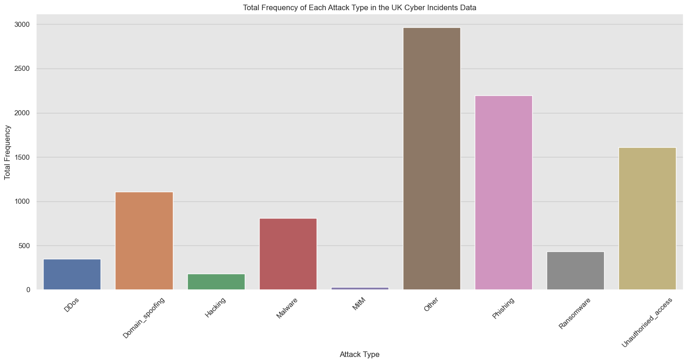

# Time-Series-Project
This project is based on my final independent project conducted for my Msc. Computer Science with Cyber security degree at the University of York.

## Project Title: ARIMA and Prophet: A Comparison of Time-Series Analysis Models for Forecasting Cyber-Security Incidents.

-  **Data Collection**:   The study used secondary data from three reputable sources known for providing extensive #ber event data: the UK Data Service, Statista, and the DPHHS of the United States. These platforms contributed extensive datasets for the study, including government statistics, analytics, and a detailed breach database from the healthcare industry.
-    
- **Data Pre-processing**: Data was pre-processed for analysis and model building using Jupyter notebooks with Python >3.10. Descriptive statistics was also used to analyse the individual data, before being combined to proudce a time-series data for analysis and model building.
- 

   ## UK Data Visualization

  

  

   ## US Data Visualization   

     

     

   

   

   

   

   

   

